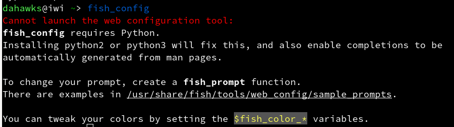

##### Fish Shell
1. 安装`Fish Shell`
> sudo pacman -S fish
2. 使用`Fish Shell`
在终端上输入`fish`，它将从默认的`bash shell`切换到`fish shell`.
在终端上运行一下命令以启动Web配置界面。只需按下`Ctrl+c`即可退出。
```
$ fish_config
Web config started at file:///tmp/web_config680sxtu8.html
Hit ENTER to stop.
$ set -L
^C
Shutting down.
```

如果出现以下图片问题。

是因为没有安装`python`，使用命令来安装`python3`

> sudo pacman -S python3



3. 将`Fish Shell`设置为默认shell
首先使用命令获取`Fish Shell`的位置
```
$ which fish
/usr/bin/fish
```
通过运行以下命令将默认shell更改为fish shell
> sudo chsh -s /usr/bin/fish

##### oh-my-fish
1. 安装`oh-my-fish`
> curl -L https://get.oh-my.fish | fish

参考链接：
[fishshell](http://fishshell.com/)
[oh-my-fish](https://github.com/oh-my-fish/oh-my-fish)
[如何在 Linux 中安装、配置和使用 Fish Shell？ ](https://linux.cn/article-10622-1.html)
[Oh My Fish! 让你的 Shell 漂亮起来 ](https://linux.cn/article-9515-1.html)